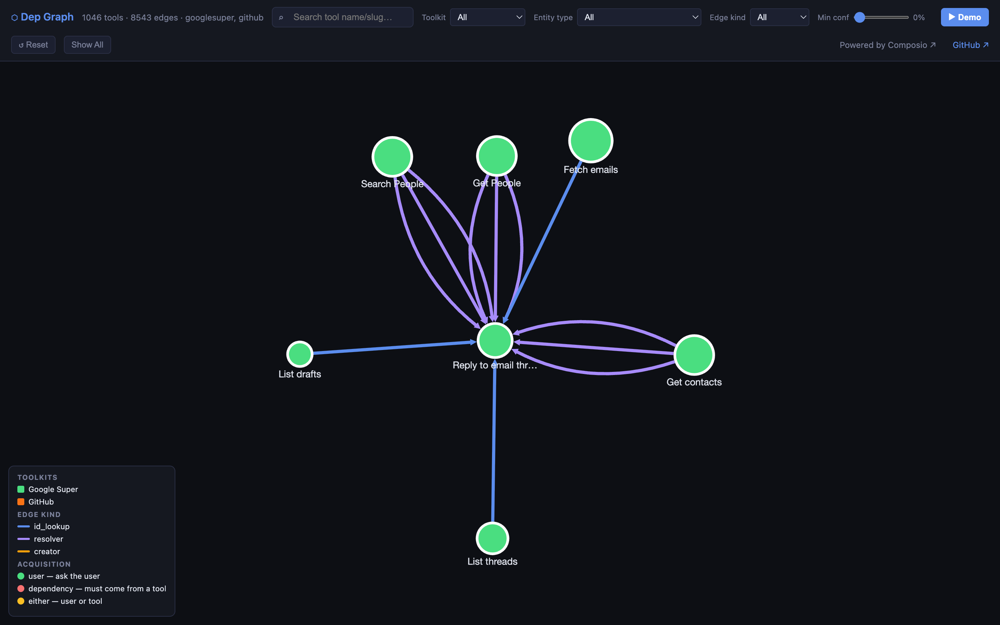

# Composio Tool Dependency Graph

A typed **dependency graph** over Composio's Google + GitHub toolkits, so an
agent runtime can automatically plan the correct pre-flight tool chain before
calling any action.

> **Live demo:** https://depgraph.tatinc.us



## The problem

Many tool calls need an opaque input that a user can't just type — a Gmail
`thread_id`, a GitHub `pull_number`, a Drive `file_id`. Those values only exist
as **outputs of other tools**. Before an agent can call
`GOOGLESUPER_REPLY_TO_THREAD`, it must first call something like
`GOOGLESUPER_LIST_THREADS` to obtain a valid `thread_id`.

This project parses every tool's input/output JSON Schemas across ~1,000 tools
and maps those producer → consumer relationships into a navigable graph, plus a
planner that turns any tool into an actionable "run these first" plan.

## Background

This started as a take-home exercise Composio sent me. I built the solution
(with Claude Code) and have open-sourced it as a portfolio piece — and because
it's a genuinely useful way to look at a tool catalog. Full technical write-up
in [SOLUTION.md](SOLUTION.md).

## Approach (short version)

Naive pairwise LLM matching across 1,000+ × 1,000+ tools is a million
comparisons — too slow and too expensive. Instead this types each parameter
into a namespaced **entity type** (`gmail.thread_id`, `github.issue_number`, …)
from its schema, then only matches producers and consumers that share a type —
reducing the search to `O(unique_types × tools_per_type)`. A small LLM pass
verifies and scores the structurally-plausible candidates rather than
discovering them. See [SOLUTION.md](SOLUTION.md) for entity-type resolution,
edge kinds (`id_lookup` / `resolver` / `creator`), and the failure taxonomy.

## Results

- **1,046 nodes** (223 googlesuper + 823 github), **8,543 edges**, **53 entity types**
- Ground-truth eval: **29/29**, dependency-param coverage **100%**
- LLM-judge edge precision: **~82%** on a stratified 100-edge sample

## Run it

Requires **Node 22+**. The graph and visualization data are committed, so you
can explore immediately:

```bash
npm run eval     # validate the committed graph against the ground-truth suite
npm run plan GOOGLESUPER_REPLY_TO_THREAD   # see a pre-flight plan for any tool
open viz/index.html                        # the interactive graph (or use the live demo)
```

To rebuild from scratch you need a free [Composio](https://composio.dev) API
key and an OpenRouter key in a `.env` file (`COMPOSIO_API_KEY=…`,
`OPENROUTER_API_KEY=…`):

```bash
npm run fetch    # pull current googlesuper + github tool catalogs
npm run build    # build data/graph.json
npm run viz      # regenerate viz/graph-data.js
```

## Repo map

| Path | What |
|------|------|
| `scripts/fetch-tools.mjs` | Pull raw tool catalogs from the Composio API |
| `scripts/build-graph.mjs` | Entity-type typing + producer/consumer edge construction (+ optional LLM verify) |
| `scripts/eval.mjs` | Ground-truth + coverage + sanity eval |
| `scripts/judge.mjs` | LLM-judge edge-precision sampler |
| `scripts/plan.mjs` | Turn the graph into a pre-execution plan for any tool |
| `viz/index.html` | Interactive Cytoscape.js visualization |
| `data/graph.json` | The output graph (see `GRAPH_SPEC.md` for the contract) |
| `SOLUTION.md` | Full approach write-up + eval + precision analysis |

## Built on Composio

This maps the **[Composio](https://composio.dev)** tool ecosystem — explore
their [Google Super](https://docs.composio.dev/toolkits/googlesuper) and
[GitHub](https://docs.composio.dev/toolkits/github) toolkits.

## License

MIT © 2026 TAT Inc — see [LICENSE](LICENSE).
